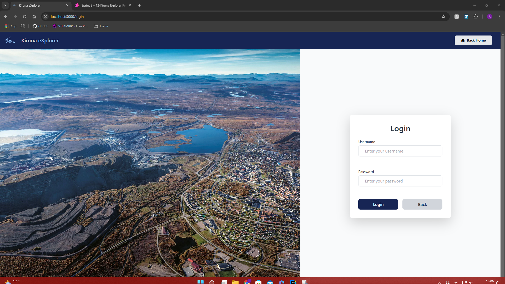
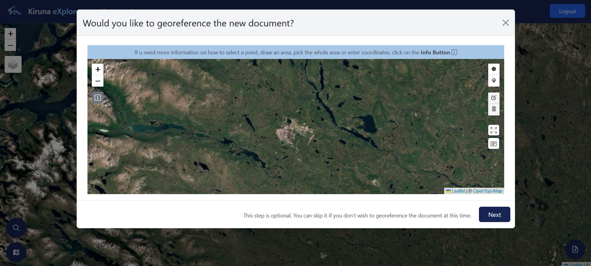
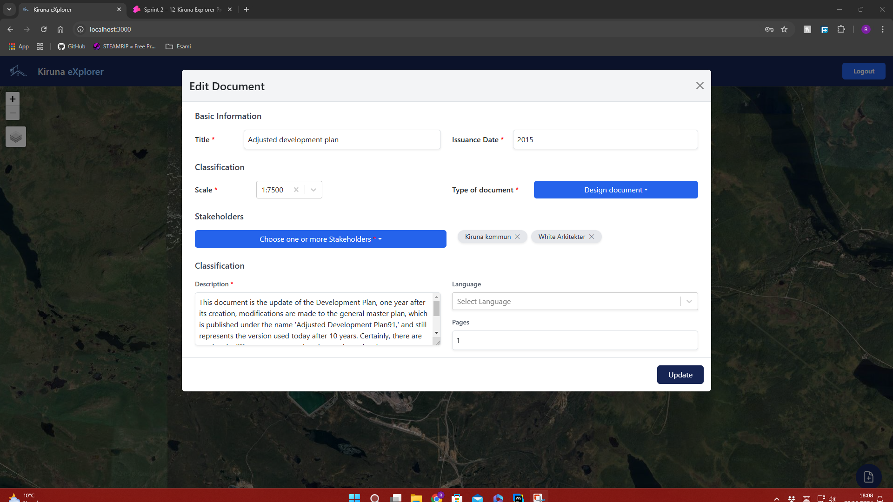
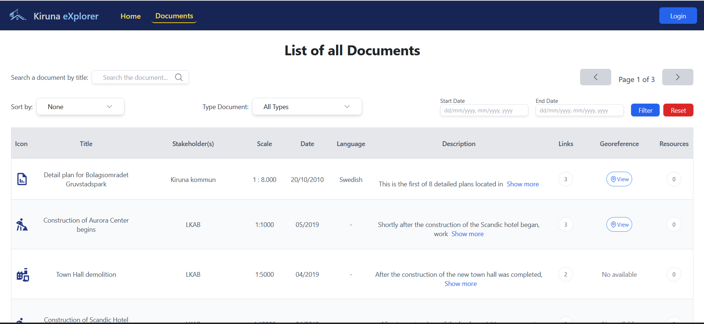
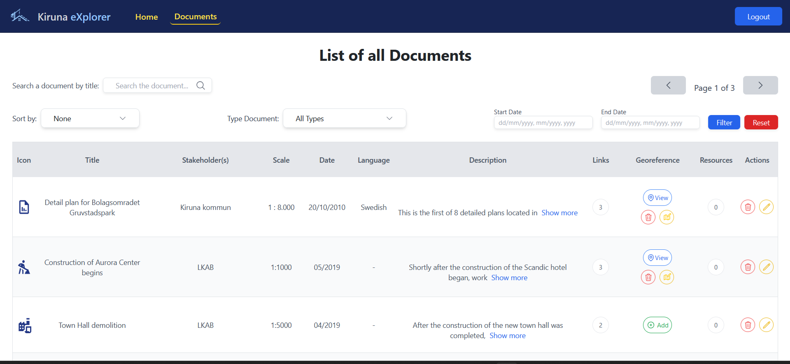

# Kiruna Explorer

## Client Routes

- Route `/`: the application homepage. Contains the navbar and a list with all the documents in the database.
- Route `documents/:idDocument/links`: page that shows all the links for a given document.
Contains the navbar and a list with all the link information.
- Route `/login`: log in page for the urban planners. Contains the navbar and a login form.
- Route `*`: fallback page shown whether the client tries to navigate to a not implemented route.
Contains the navbar and an error message

## Server API

- POST `/sessions`: performs the login of an urban planner:
  - has no parameters
  - body contains the user's username and password
  - returns a 200 code and the user's information if it's successful, a 401 code in case of errors
- DELETE `/sessions/current`: performs the logout of the current user:
  - has no parameters nor body
  - returns a 200 code in case of success, a 503 code in case of errors
- GET `/sessions/current`: retrieves the information of the currently logged-in user:
  - has no parameters nor body
  - returns a 200 code and the user's information in case of success, a 503 code in case of errors

- POST `/doc`: adds a new document to the database:
  - has no parameters
  - body contains the new document's information (title, stakeholders, scale, issue date, type, language, pages, description)
  - returns a 200 code if the document is successfully added to the database, a 401 code if user is not logged in, a 403 if user is not urban planner,
a 422 if title, scale, description and issue date are not string, or if language or page exist but are not strings, a 503 code in case of errors
- GET `/doc/:id`: retrieves a given document's info:
  - has, as the only parameter, the ID of the document to search for
  - has no body
  - returns a 200 code and the requested document's info when successful, a 404 code if the document is not present in the database, a 422 if id is empty or string,
 a 503 code in case of errors
- DELETE `/doc/:id`: removes a given document from the database:
  - has, as the only parameter, the ID of the document to delete
  - has no body
  - returns a 200 code in case of success, a 401 code if user is not logged in, a 403 if user is not urban planner, a 422 if id is empty or string,
a 503 code in case of errors
- PATCH `/doc/:id`: modifies the information about a given document:
  - has, as the only parameter, the ID of the document to edit
  - body contains the new information (title, stakeholders, scale, issue date, type, language, pages, description)
  - returns a 200 code in case of success, a 401 code if user is not logged in, a 403 if user is not urban planner, a 422 if title, scale, description and issue date are not string, or if language or page exist but are not strings, a 503 code in case of errors
- GET `/doc/:id/links`: retrieves all the links for a given document
  - has, as the only parameter, the ID of the document to search the links for
  - has no body
  - returns a 200 code and a list with all the relative links' information when successful, a 422 if id is empty or string, a 503 code in case of errors
- GET `/doc/:id/title`: retrieves the title of a document by its id
  - has, as the only parameter, the ID of the document
  - has no body
  - returns a 200 code and a title of this document when successful, a 503 code in case of errors
- GET `/doc/:id/title`: retrieves the title of a document by its id
  - has, as the only parameter, the ID of the document
  - has no body
  - returns a 200 code and a title of this document when successful, a 422 if id is empty or string, a 503 code in case of errors
- GET `/doc/:id/description`: retrieves the description of a document by its id
  - has, as the only parameter, the ID of the document
  - has no body
  - returns a 200 code and a description of this document when successful, a 422 if id is empty or string, a 503 code in case of errors
- GET `/doc/:id/issuanceDate`: retrieves the issuanceDate of a document by its id
  - has, as the only parameter, the ID of the document
  - has no body
  - returns a 200 code and a issuanceDate of this document when successful, a 422 code if ID is empty or string, a 503 code in case of errors
- GET `/doc/type`: retrieves all documents that have this type
  - has no parameters
  - body contains the type of Document
  - returns a 200 code and a issuanceDate of this document when successful, a 422 code if type is empty or not string, a 503 code in case of errors
- DELETE `doc/res/:idDoc/:name`: removes a resource from the database:
  - has two parameters, the ID of the documents, and name of resource
  - has no body
  - returns a 200 code in case of success, a 401 code if user is not logged in, a 403 if user is not urban planner, a 422 code if name is empty or not a string, or if ID is empty or is a string, a 503 code in case of error
- GET `doc/res/:idDoc/:idRes`: retrieves a resource:
  - has two parameters, the ID of the documents, and ID of resource
  - has no body
  - returns a 200 code and a resource when successful, a 401 code if user is not logged in, a 403 if user is not urban planner, a 422 if ID of document or resource are empty or string, a 503 code in case of error
- GET `doc/res-all/:idDoc`: retrieves all of resources by this ID of document:
  - has, as the only parameter, the ID of the documente
  - has no body
  - returns a 200 code and a resource when successful, a 401 code if user is not logged in, a 403 if user is not urban planner, a 422 code if ID is empty or string, a 503 code in case of error
- POST `/doc/res`: adds a new resource to document:
  - has no parameters
  - body contains the new resource's information (ID of document, name of resource, data of resource)
  - returns a 200 code if the resource is successfully added to the database, a 401 code if user is not logged in, a 403 if user is not urban planner, a 422 code if name is empty or not a string, or if ID is empty or is a string, a 503 code in case of errors

- POST `/link`: adds a new link between two documents:
  - has no parameters
  - body contains the IDs of the documents to link, and the ID of the link itself
  - returns a 200 code in case of success, a 409 code if the link is already present in the database, a 401 code if user is not logged in, a 403 if user is not urban planner, a 422 code if IDs of the documents and link are empty or a string, a 503 code in case of errors
- GET `/link`: retrieves a list of all the links in the database:
  - has no parameters nor body
  - returns a 200 code and a list with the retrieved links' info when successful, a 404 code if no links are present in the database, a 503 code in case of errors
- DELETE `/link`: removes a link from the database:
  - has no parameters
  - body contains the IDs of the documents to link, and the ID of the link itself
  - returns a 200 code in case of success, a 401 code if user is not logged in, a 403 if user is not urban planner, a 422 code if IDs of the documents and link are empty or a string, a 503 code in case of errors
- PATCH `/link`: modifies a link's information
  - has no parameters
  - body contains the IDs of the documents to link, and the ID of the link itself
  - returns a 200 code in case of success, a 404 code if the link is not present in the database, a 409 code if the updated link is already present in the database,  a 401 code if user is not logged in, a 403 if user is not urban planner, a 422 code if IDs of the documents and link are empty or a string, a 503 code in case of errors

- GET `/stakeholders`: retrieves a list of all the stakeholders in the database:
  - has no parameters nor body
  - returns a 200 code and a list with the retrieved stakeholders' info when successful, a 503 code in case of errors
- POST `/stakeholders`: adds new stakeholder to the database:
  - has no parameters
  - body contains the name of new stakeholder, and its category
  - returns a 201 code and ID of added stakeholder' when successful, a 422 code if name and category of stakeholder are empty or are not a string, a 503 code in case of errors

    
- GET `/type`: retrieves a list of all the types in the database:
  - has no parameters nor body
  - returns a 200 code and a list with the retrieved types' info when successful, a 503 code in case of errors
- POST `/type`: adds new type to the database:
  - has no parameters
  - body contains the name of new type
  - returns a 201 code and ID of added type' when successful, a 422 code if name is empty or is not a string, a 503 code in case of errors
 

- GET `/scale`: retrieves a list of all the scales in the database:
  - has no parameters nor body
  - returns a 200 code and a list with the retrieved scales' info when successful, a 503 code in case of errors
- POST `/scales`: adds new scales to the database:
  - has no parameters
  - body contains the name of new scale
  - returns a 201 code and ID of added stakeholder' when successful, a 422 code if name is empty or is not a string, a 503 code in case of errors
    

- GET `/coordinates`: retrieves all the geo-referenced documents in the database:
  - has no parameters nor body
  - returns a 200 code and a list with all the documents' information when successful, a 503 code in case of errors
- POST `/coordinates`: adds geo-referencing information to a document:
  - has no parameters
  - body contains the id of the document to update and the coordinates (or list of coordinates) to geo-reference the document
  - returns a 200 code when successful, a 401 code if user is not logged in, a 403 if user is not urban planner, a 422 if id is empty or string, a 503 code in case of errors
- PATCH `/coordinates/update`: edits the geo-referencing information of a document:
  - has no parameters
  - body contains the id of the document to update and the new coordinates (or list of coordinates)
  - returns a 200 code when successful, a 401 code if user is not logged in, a 403 if user is not urban planner, a 422 if id is empty or string, a 503 code in case of errors
- DELETE `/coordinates/:id`: deletes the geo-referencing information of a document:
  - has one parameter for id of the document
  - has no parameters
  - returns a 200 code when successful, a 401 code if user is not logged in, a 403 if user is not urban planner, a 422 if id is empty or string, and a 503 code in case of errors

## Database Tables

- Table `users`: contains a row for each user (urban planner), with the attributes:
  - username TEXT NOT NULL UNIQUE (primary key)
  - name TEXT NOT NULL
  - surname TEXT NOT NULL
  - role TEXT NOT NULL
  - password TEXT
  - salt TEXT
- Table `documents`: contains a row for each document, with attributes:
  - id INTEGER NOT NULL UNIQUE (primary key with autoincrement)
  - title TEXT NOT NULL
  - scale TEXT NOT NULL
  - issuance_date TEXT NOT NULL
  - type TEXT NOT NULL
  - language TEXT
  - pages TEXT
  - description TEXT NOT NULL
- Table `links`: contains a row for each link type (Direct consequence, Collateral consequence, Prevision, Update), with attributes:
  - id INTEGER NOT NULL UNIQUE (primary key with autoincrement)
  - name TEXT NOT NULL
- Table `documents_links`: contains a row for each link, with attributes:
  - id_document1 INTEGER NOT NULL (foreign key `documents.id`)
  - id_document2 INTEGER NOT NULL (foreign key `documents.id`)
  - id_link TEXT NOT NULL (foreign key `links.id`)
  - the combination of all 3 attributes acts as primary key
- Table `stakeholders`: contains a row for each stakeholder, with attributes:
  - id INTEGER NOT NULL UNIQUE (primary key with autoincrement)
  - name TEXT NOT NULL
  - category TEXT NOT NULL
- Table `stakeholders_documents`: contains a row for each combination of (stakeholder, document): with attributes
  - id_stakeholder INTEGER NOT NULL (foreign key `stakeholders.id` ON DELETE CASCADE)
  - id_document INTEGER NOT NULL (foreign key `documents.id` ON DELETE CASCADE)
  - the combination of both attributes serves as primary key
-  Table `documents_coordinates`: contains a row for each set of coordinates and information on the order of the points in the list of coordinates associated with a document
   - id INTEGER (primary key with autoincrement)
   - document_id INTEGER (foreign key `documents.id`)
   - latitude REAL
   - longitude REAL
   - point_order INTEGER
   - municipality_area INTEGER NOT NULL
- Table `original_resources`: contains a row for each resource that attach to document, with attributes:
   - resource_id INTEGER (primary key with autoincrement)
   - document_id INTEGER NOT NULL (foreign key `documents.id` ON DELETE CASCADE)
   - resource_name TEXT NOT NULL
   - resource_data BLOB NOT NULL
   - uploaded_at TIMESTAMP DEFAULT CURRENT_TIMESTAMP
- Table `Types`: contains a row for each type, with attributes:
  - type_id INTEGER NOT NULL (primary key)
  - name TEXT NOT NULL UNIQUE
- Table `Scales`: contains a row for each scale, with attributes:
  - scale_id INTEGER NOT NULL (primary key)
  - name TEXT NOT NULL UNIQUE

## Main React Components

- `NotFoundLayout` (in `NotFoundLayout.tsx`): shows an error message (404 "page not found") and a button to return to the home page.
- `Login` (in `Login.tsx`): shows a simple form, asking for username and password, to log in.
- `LoginButton` (in `Login.tsx`): a button used to navigate to the login page. It's shown in the navbar of the homepage
when the user is not logged in.
- `LogoutButton` (in `Login.tsx`): a button used to log out a user. It's shown in the navbar of the homepage when the
user is logged in.
- `Homepage` (in `Homepage.tsx`): shows a map showing, for each document in the database with geo-referencing information, an icon
indicating the type. Clicking on the icon opens a modal showing the document's information.
- `KirunaLandingPage` (in `KirunaLandingPage.tsx`): shows a landing page as a first page.
- `ButtonHomePage` (in `Homepage.tsx`): a button used to return to the home page. It's shown in the navbar of the login
page, to return to the homepage without logging in.
- `AddDocumentModal` (in `DocumentModals.tsx`): shows a form to fill in the information for a document to add, and attaches files, as a resource, to document.
Filling and submitting the form will call the API to add a new document to the database, with the filled-in info.
- `AddNewDocumentLinksModal` (in `AddNewDocumentLinksModal.tsx`): shows a form to add links to a newly created document.
Filling and submitting the form will call the API to add the specified connections.
- `GeoreferenceNewDocumentModal` in (`GeoreferenceNewDocumentModal.tsx`): shows a map and options to specify the geo-referencing
information of a newly created document. Submitting the form will call the API to add geo-referencing information to a document.
- `ShowDocumentInfoModal` (in `DocumentModals.tsx`): shows a document's information. If the user is logged in as an
urban planner, also shows two buttons to, respectively, edit, delete and update the geo-referencing information of the document.
- `EditDocumentModal` (in `DocumentModals.tsx`): shows a form, pre-filled with the relative document's information.
Editing the information and then submitting the form will call the API to edit the document.
- `ModalEditGeoreference` (in `ModalEditGeoreference.tsx`): shows a map and the current geo-referencing information of the
relative document, with options to specify new geo-referencing information. Submitting the form will call the API to update
the geo-referencing information of the document.
- `LinksDocument` (in `LinksDocument.tsx`): shows a paged table, containing the title, stakeholders and an icon indicating the
document type of every document connected to a given one, together with the connection type. two additional buttons are displayed for each connection: one to delete it and another to edit it. At the end of the page, if the user is logged in as an urban planner, shows a button which, when clicked, opens a modal to add a new connection.
- `AddLinkModal` (in `AddLinkModal.tsx`): shows a form to select a document, with which to add a new connection, and the
connection type. When the form is filled in and submitted, an API call to add the connection is performed.
- `EditLinkModal` (in `EditLinkModal.tsx`): shows a form, prefilled with the relative link's information.
Editing and submitting the form will call the API to update a link.
- `Map` (in `Map.tsx`): the component used to display the map, on top of which the icons for the documents will be displayed, in the homepage.
- `Alert` (in `Alert.tsx`): is displayed as a alert in most components, such as AddDocument, AddLink, and EditDocument, to notify the urban planner of an existing mistake or that something is wrong.
- `ConfirmModal` (in `ConfirmModal.tsx`): is displayed to delete a connection or resource. It is used in the LinksDocument component and appears when an urban planner clicks the button to delete a connection. Additionally, it is used in the ResourcesTable component and appears when an urban planner clicks the button to delete a resource.
- `DocumentsTable` (in `DocumentsTable.tsx`): displays a list of all documents along with their information and the number of links. Clicking on the number of links redirects to a page that lists all the links associated with the document. Similarly, clicking on the number of resources redirects to a page that lists all the resources of the document. If the user is logged in as an urban planner, additional buttons are shown to edit or delete the document and to edit, add, or delete the georeference of the document.
- `ResourcesDocument` (in `ResourcesDocument.tsx`): shows a paged table, containing the list of resources of document. Additionally, is displayed for each resource: one button to delete. At the end of the page, if the user is logged in as an urban planner, shows a button which, when clicked, opens a modal to add a new resource.
- `Diagram` (in `Diagram.tsx`): the component used to display all documents and their links on a diagram.
- `DocumentLegend` (in `DocumentLegend.tsx`): is used on diagram component, and shows signs on a diagram to guide user.    

## Screenshots

Homepage:

Map:

Diagram:

Document info in Diagram Page: 

Document info in Map page: 

Document info: (urban planner)

Connections:

Connections: (urban planner)

Login page:

New document modal:

New document geo-referencing modal:

New document connections modal:

Edit document modal:

Edit document geo-referencing modal:

New connection modal:

Update connection modal:

Documents Page:

Documents Page: (urban planner)

Resources Page:

Add resources:

## Users credentials

- Generic urban planner:
  - username: urban_planner
  - password: admin
- Generic resident:
  - username: resident
  - password: admin
- Generic urban developer:
  - username: urban_developer
  - password: admin
 
