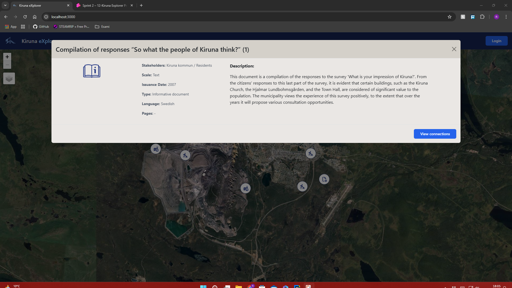
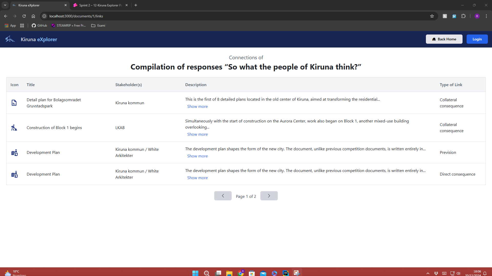
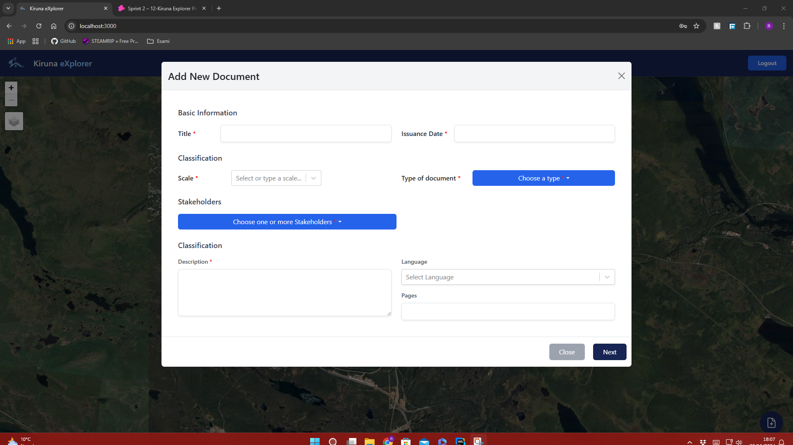
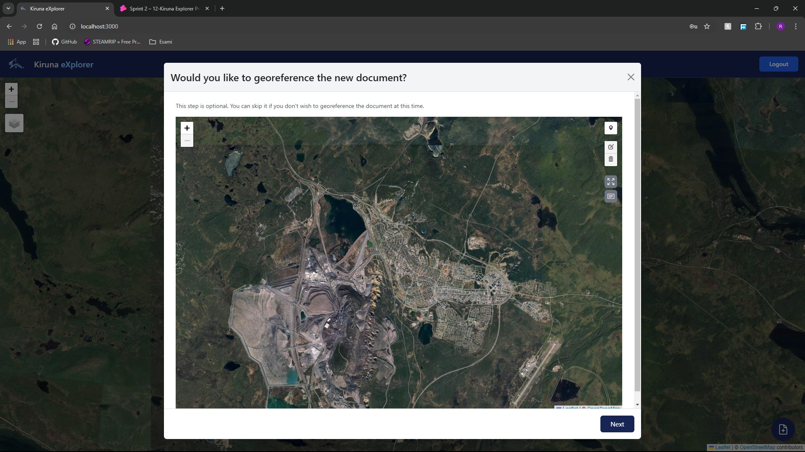
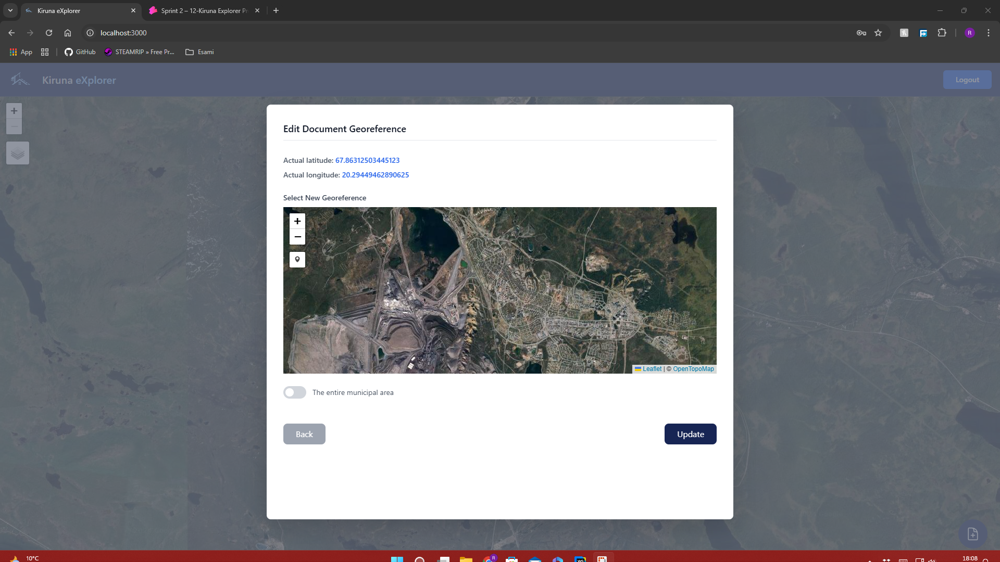

# Kiruna Explorer

## Client Routes

- Route `/`: the application homepage. Contains the navbar and a list with all the documents in the database.
- Route `documents/:idDocument/links`: page that shows all the links for a given document.
Contains the navbar and a list with all the link information.
- Route `/login`: log in page for the urban planners. Contains the navbar and a login form.
- Route `*`: fallback page shown whether the client tries to navigate to a not implemented route.
Contains the navbar and an error message

## Server API

- POST `/sessions`: performs the login of an urban planner:
  - has no parameters
  - body contains the user's username and password
  - returns a 200 code and the user's information if it's successful, a 401 code in case of errors
- DELETE `/sessions/current`: performs the logout of the current user:
  - has no parameters nor body
  - returns a 200 code in case of success, a 503 code in case of errors
- GET `/sessions/current`: retrieves the information of the currently logged-in user:
  - has no parameters nor body
  - returns a 200 code and the user's information in case of success, a 503 code in case of errors

- POST `/doc`: adds a new document to the database:
  - has no parameters
  - body contains the new document's information (title, stakeholders, scale, issue date, type, language, pages, description)
  - returns a 200 code if the document is successfully added to the database, a 503 code in case of errors
- GET `/doc`: retrieves all the documents in the database:
  - has no parameters nor body
  - returns a 200 code and a list with all the documents' information when successful, a 503 code in case of errors
- GET `/doc/:id`: retrieves a given document's info:
  - has, as the only parameter, the ID of the document to search for
  - has no body
  - returns a 200 code and the requested document's info when successful, a 404 code if the document is not present in the database, a 503 code in case of errors
- DELETE `/doc/:id`: removes a given document from the database:
  - has, as the only parameter, the ID of the document to delete
  - has no body
  - returns a 200 code in case of success, a 503 code in case of errors
- PATCH `/doc/:id`: modifies the information about a given document:
  - has, as the only parameter, the ID of the document to edit
  - body contains the new information (title, stakeholders, scale, issue date, type, language, pages, description)
  - returns a 200 code in case of success, a 503 code in case of errors
- GET `/doc/:id/links`: retrieves all the links for a given document
  - has, as the only parameter, the ID of the document to search the links for
  - has no body
  - returns a 200 code and a list with all the relative links' information when successful, a 503 code in case of errors

- POST `/link`: adds a new link between two documents:
  - has no parameters
  - body contains the IDs of the documents to link, and the ID of the link itself
  - returns a 200 code in case of success, a 409 code if the link is already present in the database, a 503 code in case of errors
- GET `/link`: retrieves a list of all the links in the database:
  - has no parameters nor body
  - returns a 200 code and a list with the retrieved links' info when successful, a 404 code if no links are present in the database, a 503 code in case of errors
- DELETE `/link`: removes a link from the database:
  - has no parameters
  - body contains the IDs of the documents to link, and the ID of the link itself
  - returns a 200 code in case of success, a 503 code in case of errors
- PATCH `/link`: modifies a link's information
  - has no parameters
  - body contains the IDs of the documents to link, and the ID of the link itself
  - returns a 200 code in case of success, a 404 code if the link is not present in the database, a 409 code if the updated link is already present in the database, a 503 code in case of errors

- GET `/stakeholders`: retrieves a list of all the stakeholders in the database:
  - has no parameters nor body
  - returns a 200 code and a list with the retrieved stakeholders' info when successful,a 404 code if no stakeholder information is on the database, a 503 code in case of errors

- GET `/coordinates`: retrieves all the geo-referenced documents in the database:
  - has no parameters nor body
  - returns a 200 code and a list with all the documents' information when successful, a 503 code in case of errors
- POST `/coordinates`: adds geo-referencing information to a document:
  - has no parameters
  - body contains the id of the document to update and the coordinates (or list of coordinates) to geo-reference the document
  - returns a 200 code when successful, a 503 code in case of errors
- PATCH `/coordinates/update`: edits the geo-referencing information of a document:
  - has no parameters
  - body contains the id of the document to update and the new coordinates (or list of coordinates)
  - returns a 200 code when successful, a 503 code in case of errors

## Database Tables

- Table `users`: contains a row for each user (urban planner), with the attributes:
  - username TEXT NOT NULL UNIQUE (primary key)
  - name TEXT NOT NULL
  - surname TEXT NOT NULL
  - role TEXT NOT NULL
  - password TEXT
  - salt TEXT
- Table `documents`: contains a row for each document, with attributes:
  - id INTEGER NOT NULL UNIQUE (primary key with autoincrement)
  - title TEXT NOT NULL
  - scale TEXT NOT NULL
  - issuance_date TEXT NOT NULL
  - type TEXT NOT NULL
  - language TEXT
  - pages TEXT
  - description TEXT NOT NULL
- Table `links`: contains a row for each link type (Direct consequence, Collateral consequence, Prevision, Update), with attributes:
  - id INTEGER NOT NULL UNIQUE (primary key with autoincrement)
  - name TEXT NOT NULL
- Table `documents_links`: contains a row for each link, with attributes:
  - id_document1 INTEGER NOT NULL (foreign key `documents.id`)
  - id_document2 INTEGER NOT NULL (foreign key `documents.id`)
  - id_link TEXT NOT NULL (foreign key `links.id`)
  - the combination of all 3 attributes acts as primary key
- Table `stakeholders`: contains a row for each stakeholder, with attributes:
  - id INTEGER NOT NULL UNIQUE (primary key with autoincrement)
  - name TEXT NOT NULL
  - category TEXT NOT NULL
- Table `stakeholders_documents`: contains a row for each combination of (stakeholder, document): with attributes
  - id_stakeholder INTEGER NOT NULL (foreign key `stakeholders.id` ON DELETE CASCADE)
  - id_document INTEGER NOT NULL (foreign key `documents.id` ON DELETE CASCADE)
  - the combination of both attributes serves as primary key
-  Table `documents_coordinates`: contains a row for each set of coordinates and information on the order of the points in the list of coordinates associated with a document
   - id INTEGER (primary key with autoincrement)
   - document_id INTEGER (foreign key `documents.id`)
   - latitude REAL
   - longitude REAL
   - point_order INTEGER
- Table `original_resources`: contains a row for each resource that attach to document, with attributes:
   - resource_id INTEGER (primary key with autoincrement)
   - document_id INTEGER NOT NULL (foreign key `documents.id` ON DELETE CASCADE)
   - resource_name TEXT NOT NULL
   - resource_data BLOB NOT NULL
   - uploaded_at TIMESTAMP DEFAULT CURRENT_TIMESTAMP

## Main React Components

- `NotFoundLayout` (in `NotFoundLayout.tsx`): shows an error message (404 "page not found") and a button to return to the home page.
- `Login` (in `Login.tsx`): shows a simple form, asking for username and password, to log in.
- `LoginButton` (in `Login.tsx`): a button used to navigate to the login page. It's shown in the navbar of the homepage
when the user is not logged in.
- `LogoutButton` (in `Login.tsx`): a button used to log out a user. It's shown in the navbar of the homepage when the
user is logged in.
- `Homepage` (in `Homepage.tsx`): shows a map showing, for each document in the database with geo-referencing information, an icon
indicating the type. Clicking on the icon opens a modal showing the document's information.
- `ButtonHomePage` (in `Homepage.tsx`): a button used to return to the home page. It's shown in the navbar of the login
page, to return to the homepage without logging in.
- `AddDocumentModal` (in `DocumentModals.tsx`): shows a form to fill in the information for a document to add.
Filling and submitting the form will call the API to add a new document to the database, with the filled-in info.
- `AddNewDocumentLinksModal` (in `AddNewDocumentLinksModal.tsx`): shows a form to add links to a newly created document.
Filling and submitting the form will call the API to add the specified connections.
- `GeoreferenceNewDocumentModal` in (`GeoreferenceNewDocumentModal.tsx`): shows a map and options to specify the geo-referencing
information of a newly created document. Submitting the form will call the API to add geo-referencing information to a document.
- `ShowDocumentInfoModal` (in `DocumentModals.tsx`): shows a document's information. If the user is logged in as an
urban planner, also shows two buttons to, respectively, edit, delete and update the geo-referencing information of the document.
- `EditDocumentModal` (in `DocumentModals.tsx`): shows a form, pre-filled with the relative document's information.
Editing the information and then submitting the form will call the API to edit the document.
- `ModalEditGeoreference` (in `ModalEditGeoreference.tsx`): shows a map and the current geo-referencing information of the
relative document, with options to specify new geo-referencing information. Submitting the form will call the API to update
the geo-referencing information of the document.
- `LinksDocument` (in `LinksDocument.tsx`): shows a paged table, containing the title, stakeholders and an icon indicating the
document type of every document connected to a given one, together with the connection type. If the user is logged in as
an urban planner, additionally shows, for each connection, a button to delete it. At the end of the page, if the user
is logged in as an urban planner, shows a button which, when clicked, opens a modal to add a new connection.
- `AddLinkModal` (in `AddLinkModal.tsx`): shows a form to select a document, with which to add a new connection, and the
connection type. When the form is filled in and submitted, an API call to add the connection is performed.
- `EditLinkModal` (in `EditLinkModal.tsx`): shows a form, prefilled with the relative link's information.
Editing and submitting the form will call the API to update a link.
- `Map` (in `Map.tsx`): the component used to display the map, on top of which the icons for the documents will be displayed, in the homepage.
- `Alert` (in `Alert.tsx`): shows an alert that notifies the user that a given connection already exists. It's used in
AddLinkModal component, and shown when an urban planner tries to add an already existing connection.
- `ConfirmModal` (in `ConfirmModal.tsx`): shows a simple confirmation modal to delete a connection. It's used in the LinksDocument
component, and shown when an urban planner clicks on the button to delete a connection.

## Screenshots

Homepage:

Document info:

Connections:

Login page:

New document modal:

New document geo-referencing modal:

New document connections modal:

Edit document modal:

Edit document geo-referencing modal:

New connection modal:

Update connection modal:

## Users credentials

- Generic urban planner:
  - username: urban_planner
  - password: admin
